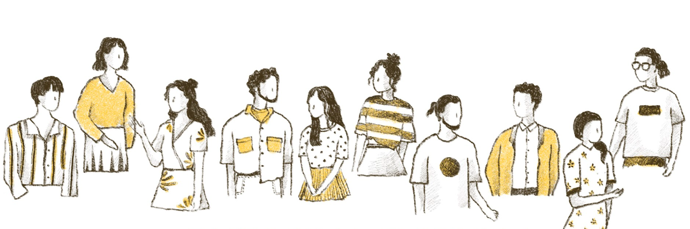

# Why Ludium? - Socioholic Public House

### &#x20;결국, 중요한 건 커뮤니티

&#x20;**** ‘왜 인간은 집단을 만드는가?’라는 질문의 정답을 찾으려는 수 없는 연구와 고민들이 여러 힌트를 남겼지. 그러나 결국 중요한 한 가지 사실은 **우리는 늘 집단을 만들고 서로를 의지하면 살았고, 분명히 앞으로도 그럴 거야.**

&#x20;그렇다면 우리는 앞으로 어떤 모습의 집단을 이루고 살까? 특히 Web3.0에서!? 너무나 당연하게 DAO(Decentralized Atonomous Organizaiton)의 모습을 띄겠지. 그리고 그 DAO들의 집단 역시 생겨날 거야. 그런데 신기한 건 현실 세계의 사람과 사람 사이에서 일어나는 현상들이 온라인에서도 일어나고 있다는 거야. 그리고 그 경향은 웹3.0과 메타버스 안에서도 비슷하게 흘러갈 거야. 시간이 흐를 수록 더 빠르게. **역사는 반복되기 마련이니까.** **그것에 대해 대비 해야 해!**

### 그런데, 지금의 크립토 커뮤니티는

&#x20;그런데 우리가 아무 문제 없이 신세계로의 항해와 정착을 해나가고 있을까? 여러 커뮤니티 들은 모두 건강하고 활기차게 자라나고 있을까? 유감스럽게도 뭔가 정체되어 있다는 느낌을 지울 수 없어. 이미 크립토 현지화된 사람들은 본인들만의 새로운 문법과 문화를 고집하고 있고(나쁘다는 뜻은 아니야!) **뉴비들은 도저히, 그 빠르게 흘러가는 흐름에 합류하지 못하고 있지.**(이게 문제지!)

&#x20;크립토 컬쳐는 성숙화 되어가는 와중에 정말 여러가지 문제들에 맞닥뜨리고 있어. 흔히 ‘채굴’이라고 부르는 과정에서의 환경 문제, 저작권 등에서 야기되는 윤리 문제, 그리고 현실 세계와의 괴리에서 오는 혼란들... .... . 어쩌면 앞으로 더 많아지고 복잡하게 되겠지. 당연히 자정과 회복의 기대가 없는 것은 아니지만 **새로운 진짜 재능들과 기회의 유입이 제한적인 지금, 어쩌면 뉴비들의 크립토 온보딩이 문제 해결의 키** 일지도 몰라.

### 그래서, 앞으로의 크립토 커뮤니티 - 루디움

&#x20;무엇보다 이제 막 진입하는 인원들을 위한 교육이 필요하겠지. 기본적인 개념부터 기술적인 부분, 개인이나 커뮤니티 프로젝트 단위로 사용 가능한 툴의 소개 등이 있을 거야. **처음 진입한 본인이 무엇이 필요한지, 앞으로의 방향성은 어떻게 설정할 것인지 등을 스스로가 결정 하도록** 도울 거야.

&#x20;어느 정도 크립토 컬쳐에 적응 된 인원들 더 심화된 교육과 인사이트를 서로 나눌 커뮤니티가 필요해. 그런 시간과 공간을 제공하고 교류를 독려하는 거야. **무엇보다 어느 프로젝트라도 분명 특정한 형태의 커뮤니티가 생기기 마련인데, 그 커뮤니티의 성숙을 돕는 게 중요해. 정보를 공유하고 함께 발전을 도모할 수 있도록** 할 거야.

### 협력 커뮤니티를 위한 믿을 수 있는 정보, 조직력, 기술력, 가이드 라인의 제공

* **커뮤니티와 ‘가디언’의 육성**

&#x20;본질은 결국 커뮤니티야. **루디움**은 새로운 커뮤니티의 생성을 돕는 역할을 할 거야. 그들은 **루디움이 제공하는 편의와 서비스 지원 안에서 초기 단계를 거치고, 나아가 스스로 자립할 수 있을 때가 오면 루디움과 동등한 위치에서 협력 관계로 발전**할 거야. 그리고 그 체계를 지키고 발전시킬 수 있는 ‘가디언’의 육성이 중요하겠지. 동등한 협력자의 입장에서 서로를 검증하고 더 나은 방향성을 제시하는 존재가 ‘가디언’이야.

* **커뮤니티의 방향성과 성숙도에 따른 분류**

&#x20;초기 커뮤니티에게 가장 중요한 것은 무엇일까? 본인들이 지금 어느 갈래에 있고 어느 수준의 성숙도인지 인지하는 것이 중요해. 그래야 지금까지 어떤 부분이 잘 되었거나 부족하고 앞으로 필요한 것, 지금 보완하고 준비할 것이 무엇인지 확실히 알 수 있도록 말이야. 그러기 위해선 많은 레퍼런스와 정보가 필요하겠지. **정제된 정보의 큐레이팅을 제공하는 게 중요해.**

* **스코어보드를 쉐어하는 다오들의 다오 구성**

&#x20;**루디움**이 생각하는 이상적인 커뮤니티는 **행위에 따른 기여도, 그에 의한 정당한 보상**이야. 협력한 만큼 **루디움**에서 가져갈 수 있는 이익이 많도록 설계하고 기본적으로 **행위와 기여를 공유할 수 있는 기술적인 지원**을 보장할 거야. 협력하고 있는 혹은 앞으로 협력 할 커뮤니티 에게 행위와 기여도가 분리된 스코어보드를 제공할 거야. 모든 행위는 기록, 공유되고 각 커뮤니티 마다 그 행위를 평가하는 기여도는 별개로 두는 거지. 한 커뮤니티의 구성원은 협력하고 있는 다른 커뮤니티에서도 본인의 행위를 인정받고 보상을 얻거나 기여할 수 있어.

